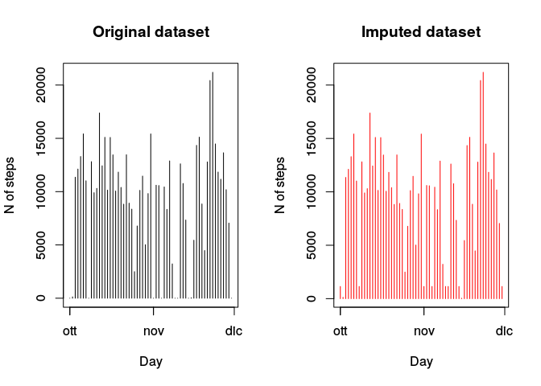
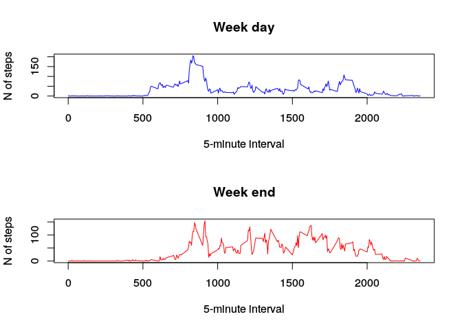

# Reproducible Research: Peer Assessment 1

## Loading and preprocessing the data

I load the data from the github repository


```r
# loading packages
library(RCurl)
```

```
## Loading required package: bitops
```

```r
# get url
URL <- "https://d396qusza40orc.cloudfront.net/repdata%2Fdata%2Factivity.zip"

# getting work directory
directory <- getwd()

# downloading zip file
download.file(URL, 
              destfile= paste(directory,"/activity.zip", sep=""),
              method="libcurl")

# extracting zip file
unzip("activity.zip")

# getting file directory
file <- paste(directory, "/activity.csv", sep="")

# loading data into R
data <- read.csv("activity.csv")
```

## What is mean total number of steps taken per day?

I calculate the total number of steps taken per day and I show the histogram.


```r
# loading package
library(dplyr)
```

```
## 
## Attaching package: 'dplyr'
## 
## The following object is masked from 'package:stats':
## 
##     filter
## 
## The following objects are masked from 'package:base':
## 
##     intersect, setdiff, setequal, union
```

```r
# summarise data per day into a new dataframe
days <- summarise(group_by(data, date), tot_steps =sum(steps,na.rm = T))

# transforming string to date
days$date <- strptime(days$date, format = "%Y-%m-%d")

# plotting histogram of mean steps per day
plot(y=days$tot_steps, x=days$date, type = "h", xlab="Day", ylab="N of steps")
```

 


```r
# calculating mean and median of steps per day
media <- round(mean(days$tot_steps, na.rm = T),0)
mediana <- median(days$tot_steps, na.rm = T)
```

The mean of steps taken per day is 9354 and the median is 10395.

## What is the average daily activity pattern?

I Plot the  5-minute interval time series of the average number of steps taken


```r
# summarise data per interval into a new dataframe
intervals <-  summarise(group_by(data, interval),
                        mean_steps = mean(steps,na.rm = T))

# plotting time series
plot(intervals$mean_steps~intervals$interval, na.rm = T, 
     type="l", 
     xlab="5-minute interval",
     ylab="N of steps")
```

 


```r
max_interval <- intervals$interval[intervals$mean_steps==max(intervals$mean_steps)]
```

The 5-minute interval number 835 contains on average the maximum number of steps.


```r
max_steps <- round(max(intervals$mean_steps),0)
```

The average number of steps for this 5-minute interval is 206.

## Imputing missing values

The total number of missing values in the dataset is:


```r
sum(is.na(data))
```

```
## [1] 2304
```

Each missing value is replaced with the median value of the related interval. Mean was not used beause it greatly overestimates the numeber of steps.


```r
# creating a copy of the data frame
imp_data <- data

# adding a new variable containing the median of each interval
imp_data$med_steps <- tapply(imp_data$steps, imp_data$interval, median, na.rm=T)

# replacing NA with the median of the interval
imp_data$steps[is.na(imp_data$steps)] <- imp_data$med_steps[is.na(imp_data$steps)]
```

I make two histograms of the total number of steps taken per day one for each dataset.


```r
# summarise data per day into a new dataframe
imp_days <- summarise(group_by(imp_data, date),
                      tot_steps = sum(steps,na.rm = T))

# transforming string to date
imp_days$date <- strptime(imp_days$date, format = "%Y-%m-%d")

# using two colomns for the plot
par(mfcol=c(1,2))

# plotting original data 
plot(y=days$tot_steps, x=days$date, 
     type = "h", 
     xlab="Day", 
     ylab="N of steps", 
     main="Original dataset")

# plotting imputed data
plot(y=imp_days$tot_steps, x=imp_days$date, 
     type = "h", 
     xlab="Day", 
     ylab="N of steps", 
     main="Imputed dataset", 
     col="red")
```

 


```r
media_imp <- round(mean(imp_days$tot_steps, na.rm = T),0)
mediana_imp <- median(imp_days$tot_steps, na.rm = T)
```

The mean steps per day with the imputed data is 9504 and median is 10395.

The mean of total steps per day is slightly different between the two dataset, the median is the same.

## Are there differences in activity patterns between weekdays and weekends?

I create a new variable called "weekday".


```r
# creating a variable with the name of the day
imp_data <- mutate(imp_data, weekday = weekdays(strptime(imp_data$date, format = "%Y-%m-%d")))

# replacing the name of the day with "weekday" or "weekend"
imp_data$weekday[imp_data$weekday=="lunedì"|
                     imp_data$weekday=="martedì"|
                     imp_data$weekday=="mercoledì"|
                     imp_data$weekday=="giovedì"|
                     imp_data$weekday=="venerdì"] <- "weekday"

imp_data$weekday[imp_data$weekday=="sabato"|
                     imp_data$weekday=="domenica"] <- "weekend"
```

I plot the time series for week days and week ends.


```r
# separating week days from week ends
weekday_data <- filter(imp_data, weekday == "weekday")
weekend_data <- filter(imp_data, weekday == "weekend")

# summarise by interval 
intervals_weekday <- summarise(group_by(weekday_data, interval),
                               mean_steps = mean(steps,na.rm = T))

# summarise by interval
intervals_weekend <-   summarise(group_by(weekend_data, interval),
                                mean_steps = mean(steps,na.rm = T))

# using two rows for the plot
par(mfcol=c(2,1))

# plotting weekday
plot(intervals_weekday$mean_steps~intervals_weekday$interval, 
     type="l", 
     xlab="5-minute interval",
     ylab="N of steps",
     col="blue",
     main="Week day",
     ylim=c(0,200))

# plotting weekend
plot(intervals_weekend$mean_steps~intervals_weekend$interval,
     type="l", 
     xlab="5-minute interval",
     ylab="N of steps",
     col="red",
     main="Week end",
     ylim=c(0,200))
```

 

According to the graph, the activity seems to be more distributed in the whole day during week ends; in particular in week ends the average number of steps taken in the afternoon is higher, while in the morning is slightly lower.
